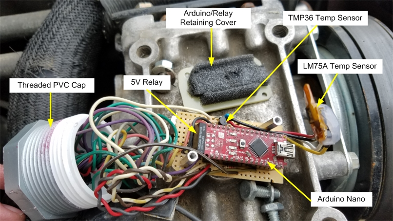
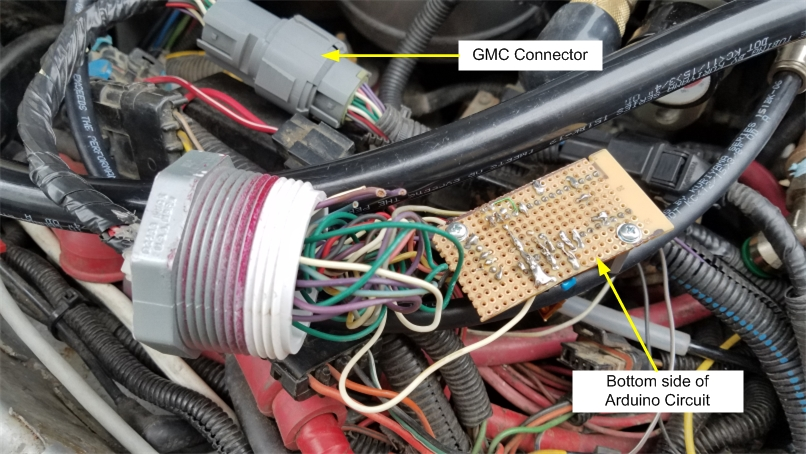

# DRuino44
DR44 / DR44G Alternator PWM Control

This Arduino sketch controls a DR44 alternator. 

## About the DR44 Alternator

The DR44 is a two wire Alternator with a built-in regulator. Well, really three wire but the third wire is not needed if adapting this alternator into another vehicle. The DR44 needs a 128Hz PWM signal to set the desired voltage output. The voltage output of the DR44 is adjusted by varying the PWM duty cycle from 5 to 95%. Duty Cycles 0-5% and 95-100% are used for diagnostic purposes. 
See PWM/Voltage scale below.
If the DR44 does not see a PWM signal, it defaults to 13.8V output.

###### DR44 PWM/Voltage scale
Commanded Duty Cycle Generator Output Voltage

|  Duty Cycle | Voltage   |
| ----------- | --------- |
|     0%      |  11.00 V  |
|    20%      |  11.56 V  |
|    30%      |  12.12 V  |
|    40%      |  12.68 V  |
|    50%      |  13.25 V  |
|    60%      |  13.81 V  |
|    70%      |  14.37 V  |
|    80%      |  14.94 V  |
|    90%      |  15.50 V  |

ref: https://ls1tech.com/forums/conversions-hybrids/1333228-2-wire-truck-alternator-wiring.html#post14432728

## What you need
1. A DR44 Alternator mounted in your vehicle.
2. An Ardiuno preferably with the ATmega328. I'm using the Nano, but you could use the Uno or Pro Mini or possibly the micro, but that one hasn't been tested yet. 
3. A Ground Wire - Connect from Arduino GND pin to vehicle chassis.
4. A Power Wire - Connect from Aruindo VIN to vehicle switched power, whatever you connect it to should only be hot (12V) when the key is switched to On (or Acc) position.
5. A PWM Control Wire - Connect from Arduino pin 9 to DR44 PWM Input. On my connector, the pin is labeled 28.
      

6. A Sense Cicuit - Two resistors (for a voltage divider), a relay, and some wire. Connect the output of the DR44 to the COM (common) contact of the relay with a piece of wire (doesn't need to be any larger than 22 AWG). Then connect the NO (Normally Open) contact of the relay to the input of the voltage divider (see schematic). Connect the output of the voltage divider to Arduino pin A7.
    - The resistors will knock down the 12-15V output from battery/alternator to something less than 5V that the Arduino can read.             Otherwise known as a voltage divider. I used a 22k and an 11k Ohm resistors for this. but you could use any other combination you       want as long as the output of the voltage divider is less than 15 or 15.5V. I don't ever plan on setting my alterntor to output         more than 15. 
    - The relay is used to isolate the battery from the Arduino when the vehicle is not on, more explanation about that later. I used a 
      small 5V coil relay that is driven off the Arduino 5V pin. But you could use a 12V relay if you want.
    - The wired connection to the DR44 output doesn't have to be right on the alternator, I connected mine at the Starter Solenoid - 
      basically a central location that the battery connects to. You could also connect to the battery as well.
 7. Lastly you'll need to flash the DRuino44.ino sketch to your Arduino using the fee [Arduino IDE](https://www.arduino.cc/en/Main/Software) software.

## Schematic
.  
    

## About the Sketch (code)
The sketch is setup as a control loop - The PWM duty cycle is adjusted based off of the desired target voltage - set by the DEFAULT_VOLTAGE define in the sketch. Set this value to what voltage you want your DR44 to output. The control loop is setup to take 10 voltage measurements, average them, then round  to the tenths decimal place as a means of digital filtering. Then we compare the  averaged voltage to the target voltage and increase or decrease the PWM duty cycle accordingly.

###### Important Note #1 - About the Voltage Divider
This setup requires you to run a sense wire from the output of the alterntor to the Arduino. The ATmega328 chip on the Aruindo runs off of 5V, so we need to step down the alterntor output down to that level. I used a simple voltage divider circuit using a 22k and a 11k Ohm resistor. The Vout of the divider should be 4V with an input of 12 from the battery and 5V with an input of 15V from the DR44. To more accurately calculate the divided voltage, I hand measured these two resistors with a DMM (digital multi meter) and recorded the values as voltageR1 and voltageR2 in the sketch. Even using actual resistor values, the measured votlage from the Arduino did not jive 
with the voltage measured from a DMM. So I had to add the voltage calibration offset (CAL_OFFSET) define. 
To set the CAL_OFFSET value to your own needs, you'll need to do the following:
1. Set the DEBUG define to 1 in the sketch and flash the updated code to your Arduino. 
2. Make all the connections from your Arduino to your DR44 and vehicle. See schematic and the What you need section above.
3. Connect your Arduino to your PC through a USB cable. 
4. Start the engine of your vehicle. 
5. Open up the Serial Monitor in the Arduino IDE and set the baud to 9600.
6. Connect a DMM to the same voltage sense points (DR44 output and GND) as the Arduino. 
7. Compare the DMM measurement to the Voltage measurent in the Serial Monitor.
8. Set the CAL_OFFSET define equal to the difference between the DMM measurement and the Arduino measurement. We are only looking for      tenths digit resolution here.
   - i.e. CAL_OFFSET = [DMM Measurement] - [Arduino Measurement] = 14.5 - 14.3 = 0.2
   - If the Arduino is measuring higher than the DMM, this value will be negative.

###### Important Note #2 - Above the Relay
Using the voltage divider resistors mentioned above, you will most likely have a combined 33k Ohm resistive path to GND. Since the output of the alternator should be connected to your battery - through a substantial fuse, of course. When the engine is off, key off, etc. there will be approximately a 0.4mA draw on your battery through these resistors. This isn't a lot, but I didn't want to take a chance on a dead battery. So I ran the voltage sense wire from the output of the alternator through a relay. The relay is driven off the 5V of the Arduino (thus a 5V coil relay was used). And the Arduino 5V isn't present until the key is switched On.

###### PWM Frequency Notes
The Required PWM frequency for DR44 is 128Hz. The Arduino PWM frequency is set to 122.5 Hz. This is as close as we can get to the required frequency and it works quite well. This sketch is setup to use Ardunio pin 9 to drive the DR44. Alternatively, pin 10 could be used. The setPwmFrequency function called within setup() sets timer1 to the base 122.5 Hz frequency. Pins 9 and 10 are controlled by timer1. See the header above the setPwmFrequency function in the sketch for more info.

## Pics installed in my 1989 Jeep Cherokee XJ
I socketed the 5V relay (meaning, I made a connector so that I can change it out if it ever fails). But the socket doesn't retain (hold the relay) really good, so I made a non-conductive cover (made out of some FR-4 material) with some foam to hold the relay in tight. The cover is attached to the two stand-offs. The two temperature sensors are part of another project where I use another Arduino in the dash with an LCD display to read voltage and the temperature. I was experimenting with the two different temp sensors here. For now, I'm using the LM75A. The PVC threaded cap is part of the water resistant enclosure seen in another pic below.

Here is the cover screwed into place. 

Here's a view of all my solder connections. Also seen is the GMC quick disconnect connector I salvaged it from my local junk yard. It's from an ealyish 2000 Chevy passenger car, something like a Monte Carlo or an Impala, I don't remember exactly. It was under the hood near the drivers side front fender. It features a fairly good water resistant connection with gold plated pins and it disconnects super easy. All those extra wires are unused pins in the connector for future expansion. I drilled a hole in the PVC threaded cap just big enough for all the wires to go through. Ran the wires through the hole, put a zip tie around the wires on both sides of the PVC cap for strain relief and RTV'd the hell out of it.

This is the PVC enclosure to protect the Arduino. I chose the size to be just big enough to fit the Arduino circuit board. I think it's 2" pipe. When the cap is threaded into place, the whole circuit board spins around in the PVC pipe. 

The complete PVC enclosure with the pigtail to the GMC connector.

